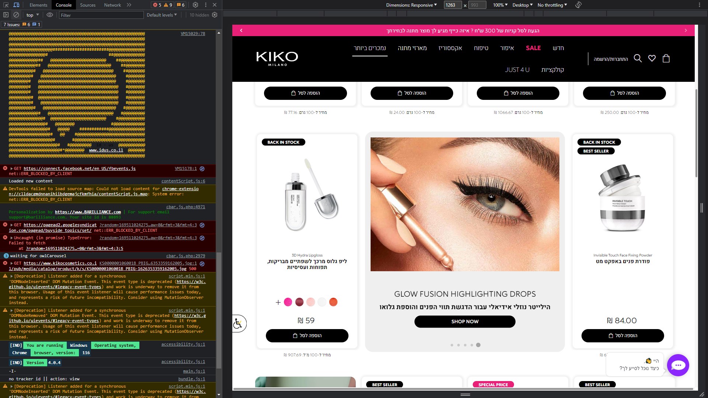

# list-item-append

## Overview

This project demonstrates how to use JavaScript to insert a styled `
` element into a web page, specifically on the Categories page of the KIKO MILANO website. The inserted `
` occupies 2 columns after the 4th product on the page. It adapts its width based on screen size: on narrower screens with 3 columns, it takes up 2/3 of the width, and on mobile devices, it spans the entire width. The `
` is styled to resemble the product style, with box-shadow and rounded corners. All CSS styles are generated dynamically using JavaScript.

## Screenshots

*Screenshot 1: Categories Page Before Script Launch*

*Screenshot 2: Categories Page After Script Launch*

## Usage

To use this code:

1. Open the Categories page of KIKO MILANO's website at [https://www.kikocosmetics.co.il/best-sellers](https://www.kikocosmetics.co.il/best-sellers).

2. Open the browser's developer console (F12) to access the browser's console.

3. Copy the provided JavaScript code from the "Copy Code" button.

4. Paste the copied code into the console and press Enter.

5. The styled `
` will be inserted into the page as described.

## Features

- Dynamically inserts a styled `
` element into the Categories page of the KIKO MILANO website.
- The inserted `
` occupies 2 columns after the 4th product.
- Responsive design: adapts its width based on screen size.
  - On narrower screens with 3 columns, it takes up 2/3 of the width.
  - On mobile devices, it spans the entire width.
- Styled to resemble the product style with box-shadow and rounded corners.
- All CSS styles are generated using JavaScript for easy customization.

## Author

This project is maintained by [Vadym4Che](https://github.com/vadym4che/).

## License

This project is open-source and available under the [MIT License](LICENSE).
